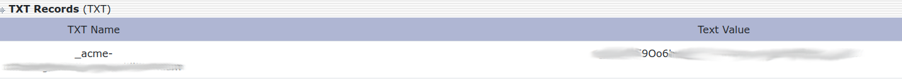

+++
title = "利用 certbot 配置 SSL 证书"

date = 2024-04-10

[taxonomies]
tags = ["Linux", "网络"]
categories = ["technology"]
+++

`certbot` 是 `Let’s Encrypt` 提供的官方工具，用于辅助获取 SSL 证书。

## certbot 安装

官方建议的安装方式是利用 `snap`。但是个人实在是讨厌 `snap` 这个工具，而是更青睐于 `apt`。`certbot` 包含在了 Debian 官方仓库中，可以直接安装。

```bash
apt install certbot
apt install certbot --install-suggests
```

如果需要 `apache` 或者 `nginx` 的自动配置，可以直接安装 suggests 部分。如果不需要，则无需添加 `--install-suggests`。

此外，还可以考虑使用 [certbot-auto](https://dl.eff.org/certbot-auto)。

## 生成 SSL 证书

### 交互式手动获取认证 `--manual`

以下两种域名可以通过指定多个 `-d` 参数一次性完成。

#### 泛域名证书

```bash
certbot run -d "*.example.com" --manual
```

泛域名认证需要添加一条 TXT 类型域名记录，根据提示操作即可。



#### 普通域名证书

```bash
certbot run -d "example.com" --manual
```

需要搭建一个临时 HTTP 服务器包含有指定的内容。

### nginx、apache 等

可以直接利用 `--nginx`、`--apache` 参数调用 plugin 辅助完成。`certbot` 会自动修改配置文件。

## 查看证书状态

证书三个月内有效，可以查看证书状态。

```bash
certbot certificates
```

## 续签证书

```bash
certbot renew
```

根据情况添加参数。续签证书和首次生成相同，需要重新进行认证。普通域名配合 `nginx` 等工具可以很方便完成，泛域名需要修改 DNS 记录。可以利用 `--manual-auth-hook` 和 `--manual-cleanup-hook` 参数来提供脚本配合 DNS 服务商的 api 实现自动修改 DNS 记录。`renew` 不支持交互方式完成。

因为获取证书有次数限制，建议使用 `--dry-run` 进行测试。测试完成后，`renew` 会自动进行 30 天内过期证书的续签工作。

参考资料：[Certbot](https://eff-certbot.readthedocs.io/en/latest/index.html)
